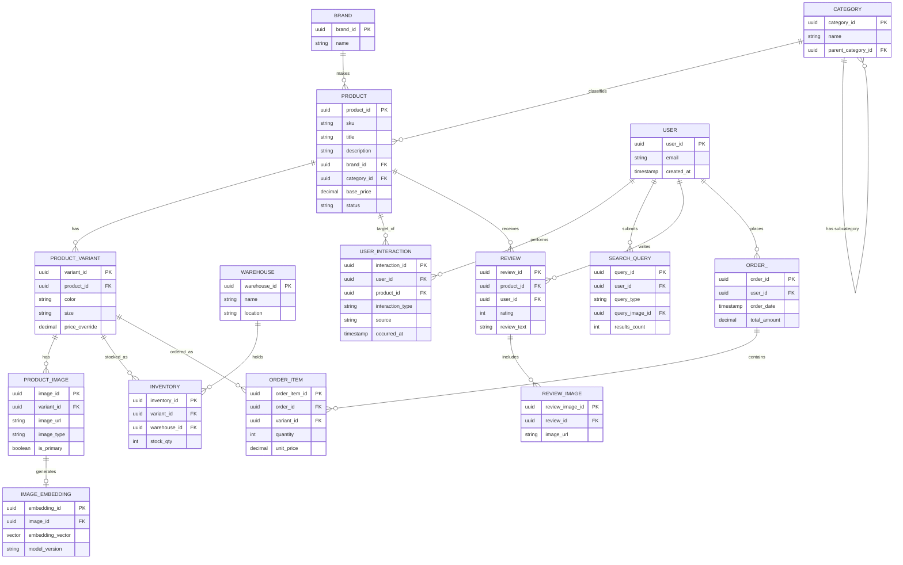

# Entity-Relationship Diagram — Visual Product Search Data Model

This diagram renders natively on GitHub (mermaid.js). It covers every entity needed to support visual product search: product catalog, imagery + embeddings, user behavior, and transactions.

## How to read this

- **Catalog spine:** `BRAND` and `CATEGORY` classify `PRODUCT`; each `PRODUCT` has one or more `PRODUCT_VARIANT` (color/size combinations), and each variant has its own images and stock.
- **Visual search core:** `PRODUCT_IMAGE` → `IMAGE_EMBEDDING` is the pair that actually powers visual search — every catalog image gets a vector embedding used for similarity lookup. `SEARCH_QUERY` can itself reference an uploaded image (`query_image_id`), which is embedded the same way and compared against `IMAGE_EMBEDDING`.
- **Behavioral loop:** `USER_INTERACTION` and `SEARCH_QUERY` capture what users do and search for; `REVIEW` (with its own `REVIEW_IMAGE`s) is a second, real-world source of product imagery distinct from staged catalog photos.
- **Transactional spine:** `ORDER_` → `ORDER_ITEM` → `PRODUCT_VARIANT` ties visual search usage back to actual revenue, and `INVENTORY` (per variant, per `WAREHOUSE`) supports "in stock near me" filtering on search results.

See [`data_dictionary.md`](data_dictionary.md) for every field's type and purpose, and [`modeling_rationale.md`](modeling_rationale.md) for why this is structured as normalized core + a denormalized search layer rather than one or the other.
